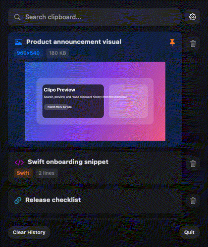
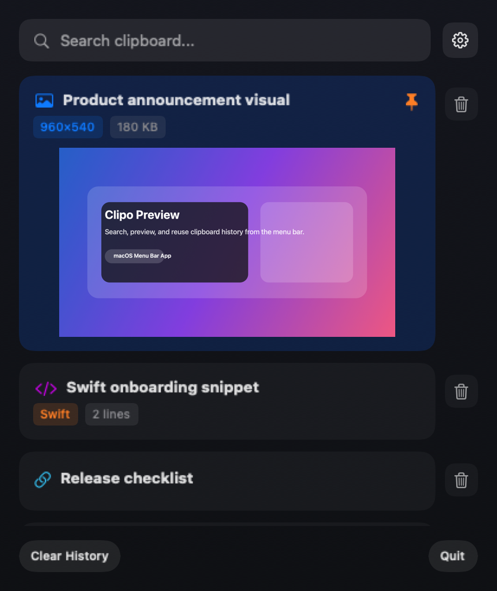
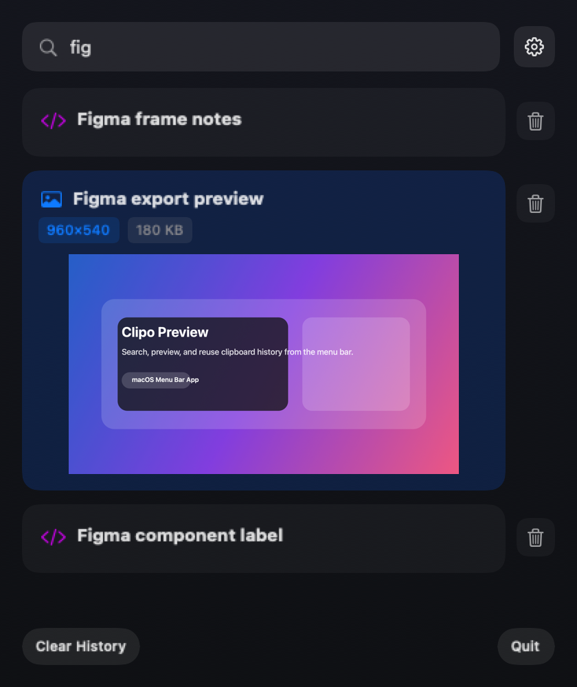

# Clipo

Clipo is a lightweight clipboard manager for macOS. It lives in the menu bar, keeps a searchable clipboard history, previews images inline, and lets you paste previous items back into the app you were using.


## Preview

Generated from the current Clipo UI components so the README stays aligned with the app.



<p align="center">
  
  
</p>

## Highlights

### Core Features
- Menu bar app with no Dock icon
- Global hotkey for quick access (`Cmd + Shift + V`)
- Searchable clipboard history with FTS5 full-text search
- Inline image previews with lazy loading
- Pin important items
- Automatic history cleanup with pinned-item protection
- Auto-paste with Accessibility permission
- Better clipboard parsing for browser and Figma content

### Performance (v2.0.0)
- **Adaptive polling**: 5s idle → 0.5s focused (saves CPU and battery)
- **Smart caching**: Instant search results with 5-minute TTL
- **Lazy image loading**: Images load only when visible
- **Background I/O**: Non-blocking disk operations
- **<1% CPU idle**, **<60MB memory**, **<50ms search latency**

### UI/UX (v2.0.0)
- **Liquid Glass design**: Modern glassmorphism with blur and saturation
- **100% keyboard navigation**: All features accessible via keyboard
- **Physics-based animations**: 60fps+ spring animations
- **Source app icons**: See which app each clipboard item came from
- **GPU-accelerated rendering**: CoreImage filters for smooth effects

## Install

### Download a release

1. Open [Releases](https://github.com/bloodstalk1/Clipo/releases)
2. Download the latest `.dmg`
3. Open the DMG and drag `Clipo.app` into `Applications`

### Build from source

```bash
git clone https://github.com/bloodstalk1/Clipo.git
cd clipo
xcodegen generate
open Clipo.xcodeproj
```

Run the app from Xcode with `Cmd + R`.

### Package a DMG

```bash
xcodegen generate
./scripts/package_dmg.sh
```

This creates a drag-to-install DMG with `Clipo.app` and an `Applications` shortcut.

## Usage

1. Open Clipo from the menu bar icon or with `Cmd + Shift + V`
2. Search or browse your clipboard history
3. Click an item to restore and paste it
4. Pin important items so they stay around longer
5. Remove individual items or clear history when needed

### Keyboard Shortcuts

| Shortcut | Action |
|----------|--------|
| `Cmd + Shift + V` | Open clipboard popup |
| `↑` / `↓` | Navigate items |
| `Cmd + ↑` / `Cmd + ↓` | Jump to top/bottom |
| `Enter` | Paste selected item |
| `Cmd + P` | Toggle pin on selected item |
| `Cmd + Backspace` | Delete selected item |
| `Cmd + F` | Focus search field |
| `Escape` | Clear search or close popup |

## Permissions

Clipo needs Accessibility permission only for auto-paste.

1. Open Clipo
2. Use the permission prompt inside the popup
3. Enable Clipo in `System Settings > Privacy & Security > Accessibility`

If Accessibility is not enabled, Clipo still stores history and restores items to the clipboard. You can paste manually with `Cmd + V`.

## Requirements

- macOS 13 or later
- Apple Silicon or Intel Mac

## Performance

v2.0.0 delivers significant performance improvements:

| Metric | v1.0.1 | v2.0.0 | Improvement |
|--------|--------|--------|-------------|
| CPU (idle) | ~2% | <1% | 50% reduction |
| Memory (1000 items) | ~80MB | <60MB | 25% reduction |
| Search latency | ~100ms | <50ms | 50% faster |
| Popup open latency | ~150ms | <100ms | 33% faster |
| Scroll frame rate | 30-45fps | 60fps+ | 2x smoother |

**Key optimizations:**
- Adaptive polling adjusts monitoring frequency based on activity
- FTS5 full-text search with smart caching
- Lazy image loading reduces memory footprint
- Background I/O prevents UI blocking
- GPU-accelerated rendering for smooth animations

## Tech Stack

### Core
- Swift 6 with strict concurrency checking
- SwiftUI + AppKit hybrid architecture
- GRDB.swift for SQLite with FTS5 full-text search
- KeyboardShortcuts for global hotkey registration
- XcodeGen for project generation

### Performance & Optimization
- Actor-based concurrency for thread-safe state management
- CoreImage GPU-accelerated rendering
- Lazy image loading with task deduplication
- Background I/O queue with retry logic
- Performance telemetry collection

### UI Components
- Liquid Glass material system with visual effects
- Physics-based spring animations
- Keyboard navigation handler (NSEvent-based)
- Virtualized list view for large datasets
- Toast notification system

## Project Structure

```text
Clipo/
├── App/
├── Features/
├── Models/
├── Persistence/
├── Support/
└── Resources/
```

## License

MIT License. See `LICENSE` for details.
