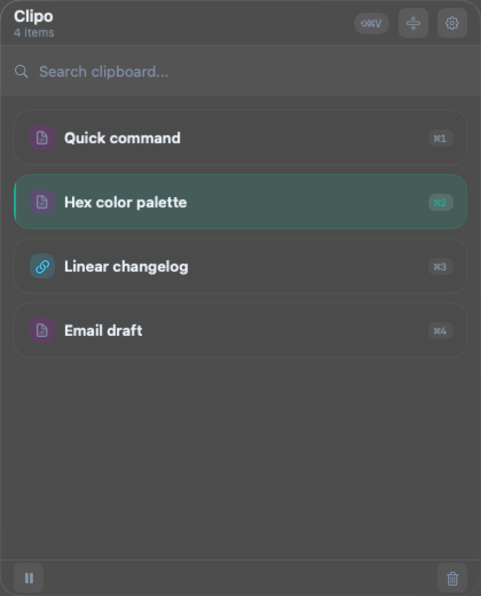
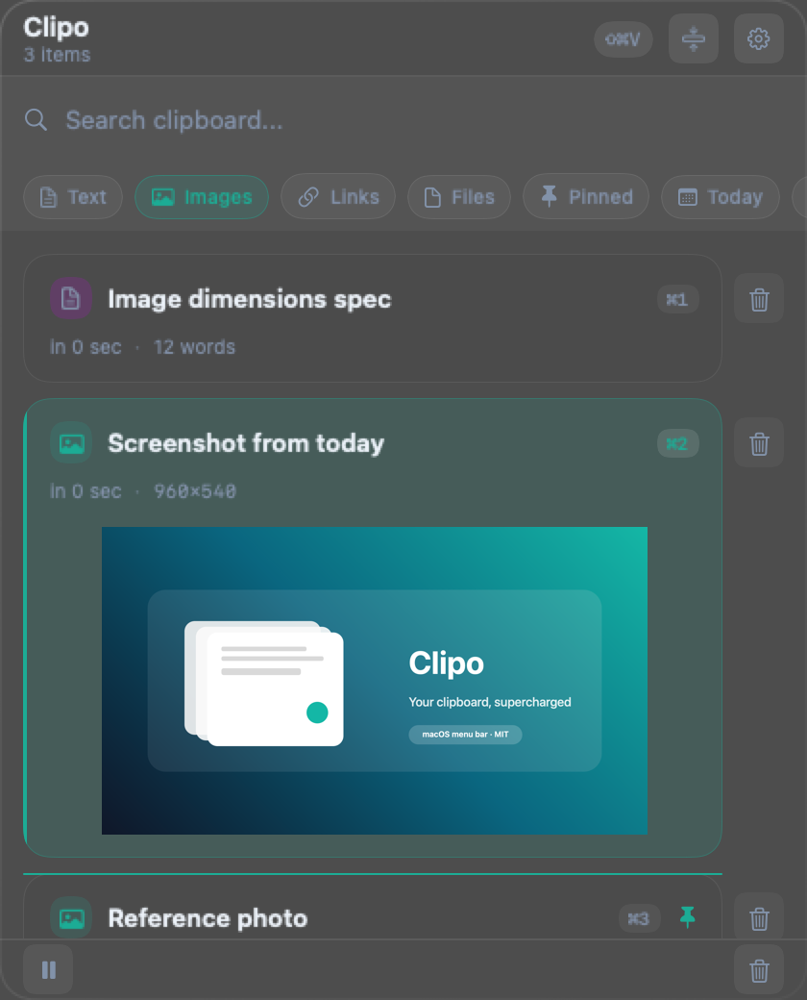

# Clipo / Clipo

**A lightweight clipboard manager for macOS.**<br>
*Trình quản lý clipboard gọn nhẹ cho macOS.*

   

| [English](#english) | [Tiếng Việt](#tiếng-việt) |
| --- | --- |

---

## English

Clipo lives in the menu bar, keeps a searchable clipboard history, previews images inline, and lets you paste previous items back into the app you were using.

### Preview


*Default popup with mixed content — image pinned, code snippet, link, and text.*

<p align="center">
  
  
</p>
<em>Left: compact mode for scanning many items. Right: inline filter chips (Images active).</em>

### Workflow


*Search-as-you-type, then filter the narrowed set with a single tap.*

### Highlights

| Feature | What it does |
| --- | --- |
| **Menu bar app** | No Dock icon. Opens with `⌘⇧V` or click the menu bar item. |
| **Visual timeline** | Each card shows a preview, source app, time, and quick metadata. |
| **Filter chips** | Filter by kind (text / image / link / file), pinned, or date. |
| **Quick Paste `⌘1..9`** | Copies the Nth most recent item to your clipboard — paste manually. |
| **Pause toggle `⌘T`** | Stop collecting history when handling sensitive content. |
| **Pin items** | Pinned items are protected from auto-delete and surface with a teal accent. |
| **Software Updates** | Auto-checks for new releases from GitHub on startup and supports manual check in Settings. |
| **Search** | Full-text search powered by SQLite FTS5 with a 5-minute cache. |
| **Accessibility auto-paste** | One-time grant; Clipo can paste back into your previous app. |

### Install

**Download a release**

1. Open [Releases](https://github.com/bloodstalk1/Clipo/releases)
2. Download the latest `.dmg`
3. Open the DMG and drag `Clipo.app` into `Applications`

**Build from source**

```bash
git clone https://github.com/bloodstalk1/Clipo.git
cd clipo
xcodegen generate
open Clipo.xcodeproj
```

Run with `⌘R` in Xcode.

**Package a DMG**

```bash
xcodegen generate
./scripts/package_dmg.sh
```

### Usage

1. Open Clipo with `⌘⇧V` or click the menu bar icon
2. Search or browse the history — type to filter, or tap a chip below the search field
3. Press `Enter` to paste the highlighted item, or click any row
4. Hold `⌘` and press a number (`⌘1`..`⌘9`) to grab the Nth recent item
5. Press `⌘T` to pause history collection when copying passwords or sensitive data
6. Right-click any row for **Pin / Unpin**, **Copy as Plain Text**, **Delete**
7. Use the footer pause button to resume history collection

### Keyboard shortcuts

| Shortcut | Action |
| --- | --- |
| `⌘⇧V` | Toggle the clipboard popup |
| `⌃⌥V` | Open paste picker (screen extension) |
| `↑` / `↓` | Navigate items |
| `⌘↑` / `⌘↓` | Jump to top / bottom |
| `Enter` | Paste the selected item |
| `⌘1`..`⌘9` | Quick paste (1st–9th most recent item) |
| `⌘P` | Pin / unpin the selected item |
| `⌘T` | Pause / resume history collection |
| `⌘F` | Focus the search field |
| `Esc` | Clear search, then close popup |

All shortcuts except navigation can be reassigned in **Settings → Shortcuts**.

### Permissions

Clipo needs **Accessibility** permission only for auto-paste. Without it, Clipo still stores history and restores items to the clipboard so you can paste manually with `⌘V`.

1. Open Clipo and click the yellow banner in the popup (or **Settings → Privacy**)
2. Enable Clipo in **System Settings → Privacy & Security → Accessibility**

### Requirements

- macOS 13 or later
- Apple Silicon or Intel Mac

### Tech stack

| Layer | What we use |
| --- | --- |
| Language | Swift 6 with strict concurrency |
| UI | SwiftUI + AppKit hybrid (NSVisualEffectView material for the popup) |
| Persistence | GRDB.swift + SQLite FTS5 for full-text search |
| Hotkeys | KeyboardShortcuts (global hotkey registration) |
| Project | XcodeGen |

---

## Tiếng Việt

Clipo chạy trong thanh menu bar, lưu giữ lịch sử clipboard có thể tìm kiếm, xem trước ảnh trực tiếp, và cho phép dán lại các mục trước đó vào app bạn đang dùng.

### Xem trước


*Popup mặc định với nội dung hỗn hợp — ảnh đã ghim, đoạn code, link, và văn bản.*

<p align="center">
  
  
</p>
<em>Trái: chế độ compact để quét nhiều mục. Phải: chip bộ lọc trực tiếp (Images đang bật).</em>

### Quy trình sử dụng


*Gõ để tìm kiếm, sau đó lọc kết quả bằng một chạm.*

### Tính năng chính

| Tính năng | Mô tả |
| --- | --- |
| **Menu bar app** | Không có icon trên Dock. Mở bằng `⌘⇧V` hoặc click biểu tượng menu bar. |
| **Dòng thời gian trực quan** | Mỗi thẻ hiển thị bản xem trước, app nguồn, thời gian, metadata nhanh. |
| **Chip bộ lọc** | Lọc theo loại (văn bản / ảnh / link / file), đã ghim, hoặc ngày. |
| **Quick Paste `⌘1..9`** | Sao chép mục gần nhất thứ N vào clipboard — bạn tự dán. |
| **Tạm dừng `⌘T`** | Ngừng thu thập lịch sử khi xử lý nội dung nhạy cảm. |
| **Ghim mục** | Mục đã ghim được bảo vệ khỏi xóa tự động và hiển thị viền teal. |
| **Cập nhật phần mềm** | Tự động kiểm tra bản phát hành mới từ GitHub khi khởi động và hỗ trợ kiểm tra thủ công trong Settings. |
| **Tìm kiếm** | Full-text search qua SQLite FTS5 với cache 5 phút. |
| **Auto-paste qua Accessibility** | Cấp quyền một lần; Clipo có thể dán vào app trước đó. |

### Cài đặt

**Tải bản phát hành**

1. Mở [Releases](https://github.com/bloodstalk1/Clipo/releases)
2. Tải file `.dmg` mới nhất
3. Mở DMG và kéo `Clipo.app` vào thư mục **Applications**

**Build từ source**

```bash
git clone https://github.com/bloodstalk1/Clipo.git
cd clipo
xcodegen generate
open Clipo.xcodeproj
```

Chạy bằng `⌘R` trong Xcode.

**Đóng gói DMG**

```bash
xcodegen generate
./scripts/package_dmg.sh
```

### Cách sử dụng

1. Mở Clipo bằng `⌘⇧V` hoặc click biểu tượng menu bar
2. Tìm kiếm hoặc duyệt lịch sử — gõ để lọc, hoặc chạm chip bên dưới ô tìm kiếm
3. Nhấn `Enter` để dán mục đang chọn, hoặc click vào hàng bất kỳ
4. Giữ `⌘` rồi nhấn số (`⌘1`..`⌘9`) để lấy mục gần nhất thứ N
5. Nhấn `⌘T` để tạm dừng thu thập lịch sử khi copy mật khẩu hoặc dữ liệu nhạy cảm
6. Click phải vào hàng bất kỳ để **Ghim / Bỏ ghim**, **Sao chép dạng văn bản thuần**, **Xóa**
7. Dùng nút pause ở footer để tiếp tục thu thập lịch sử

### Phím tắt

| Phím tắt | Hành động |
| --- | --- |
| `⌘⇧V` | Bật/tắt popup clipboard |
| `⌃⌥V` | Mở paste picker (mở rộng màn hình) |
| `↑` / `↓` | Di chuyển giữa các mục |
| `⌘↑` / `⌘↓` | Nhảy lên đầu / xuống cuối |
| `Enter` | Dán mục đang chọn |
| `⌘1`..`⌘9` | Quick paste (mục gần nhất thứ 1–9) |
| `⌘P` | Ghim / bỏ ghim mục đang chọn |
| `⌘T` | Tạm dừng / tiếp tục thu thập lịch sử |
| `⌘F` | Focus vào ô tìm kiếm |
| `Esc` | Xóa tìm kiếm, rồi đóng popup |

Mọi phím tắt (trừ di chuyển) có thể gán lại trong **Settings → Shortcuts**.

### Quyền (Permissions)

Clipo cần quyền **Accessibility** chỉ cho auto-paste. Nếu không có, Clipo vẫn lưu lịch sử và đưa nội dung vào clipboard — bạn tự dán bằng `⌘V`.

1. Mở Clipo và click banner vàng trong popup (hoặc **Settings → Privacy**)
2. Bật Clipo trong **System Settings → Privacy & Security → Accessibility**

### Yêu cầu hệ thống

- macOS 13 trở lên
- Apple Silicon hoặc Intel Mac

### Tech stack

| Lớp | Công nghệ sử dụng |
| --- | --- |
| Ngôn ngữ | Swift 6 với strict concurrency |
| UI | SwiftUI + AppKit hybrid (NSVisualEffectView cho popup) |
| Lưu trữ | GRDB.swift + SQLite FTS5 cho tìm kiếm toàn văn |
| Phím tắt | KeyboardShortcuts (đăng ký phím tắt toàn cục) |
| Dự án | XcodeGen |

---

## License

MIT License. See `LICENSE` for details.
